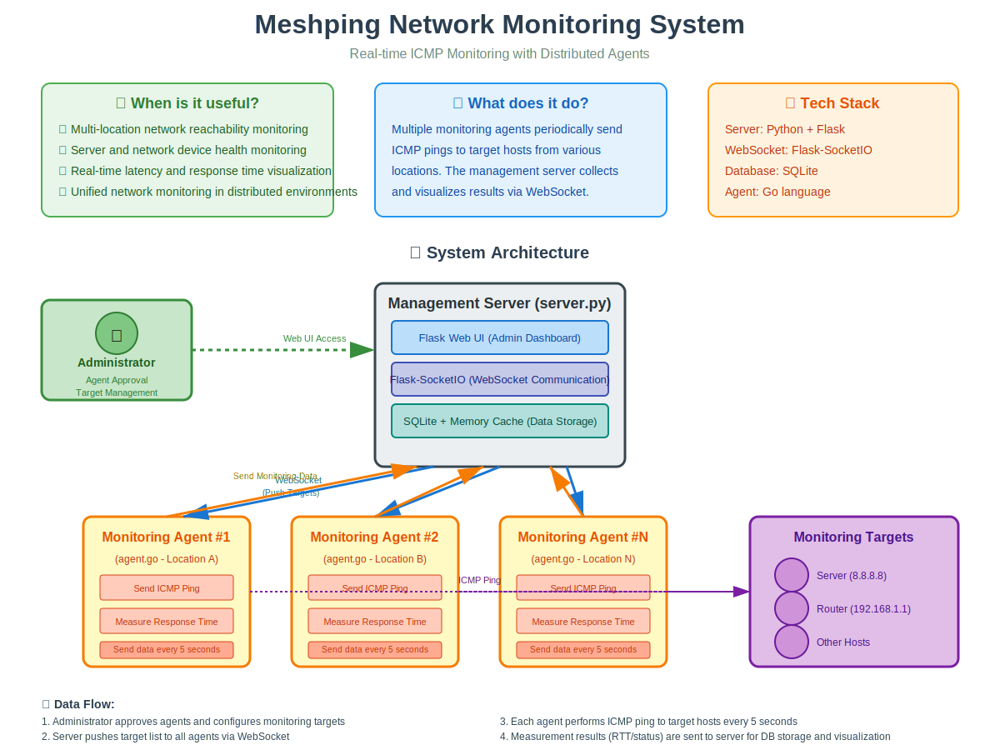

# Meshping

[日本語版 README はこちら (Japanese README)](README.ja.md)

Meshping is a network monitoring system consisting of a management server and distributed monitoring agents.  
This project includes a management server built with Flask/Flask-SocketIO and SQLite, along with monitoring agents written in Go.

## System Architecture Overview

See the diagram below for an overview of the system architecture and data flow:



*Also available in [Japanese](architecture_overview.svg)*

## Documentation

- **[Baseline Requirements](BASELINE_REQUIREMENTS.md)** - Current PoC implementation status vs. specification gaps
- **[Full Specification](specs.txt)** - Complete feature specification (Japanese)
- **[Implementation Details](implementation.txt)** - Technical implementation overview

## Architecture

- **Management Server (server.py)**
  - Flask-based Web UI and REST API (admin dashboard, target update API, etc.)
  - WebSocket communication with agents via Flask-SocketIO
  - Storage of agent information and monitoring data using SQLite
  - Administrators can approve agents, update monitoring target lists, etc.

- **Monitoring Agent (agent.go)**
  - ICMP monitoring implemented in Go (using golang.org/x/net/icmp and ipv4)
  - Sends handshake and agent information to the management server on startup; receives monitoring target list upon registration
  - Updates monitoring targets based on push notifications from the management server
  - Asynchronously sends ICMP echo requests to each monitoring target every 5 seconds and reports results to the server

## Requirements

### Management Server
- Python 3.x
- Packages:
  - Flask
  - Flask-SocketIO
  - Flask-SQLAlchemy
  - eventlet or gevent (for SocketIO backend)
- SQLite (initial implementation)

### Monitoring Agent
- Go 1.x
- Packages:
  - github.com/gorilla/websocket
  - golang.org/x/net/icmp
  - golang.org/x/net/ipv4
- Administrator privileges or raw socket permissions are required for ICMP packet transmission

## Installation

### Management Server
1. Set up a virtual environment (optional)
   ```bash
   python3 -m venv venv
   source venv/bin/activate
   ```
2. Install required packages
   ```bash
   pip install flask flask-socketio flask-sqlalchemy eventlet
   ```

### Monitoring Agent
1. Set up Go environment
2. Install required packages (use `go.mod` for module management)
   ```bash
   go get github.com/gorilla/websocket
   go get golang.org/x/net/icmp
   go get golang.org/x/net/ipv4
   ```

## Usage

### Management Server
1. The database will be created automatically if it doesn't exist.
2. Start the server:
   ```bash
   python server.py
   ```
3. Access the admin dashboard at `http://localhost:5000/admin` in your browser.

### Monitoring Agent
1. Build and run the agent:
   ```bash
   go build -o agent agent.go
   sudo ./agent
   ```
   *Note: Administrator privileges may be required for ICMP transmission.*

## Project Overview

- **Monitoring Target List Management**
  - The management server pushes monitoring target lists to all agents.
  - Agents perform ICMP monitoring based on the target list received upon registration and subsequent updates.

- **Data Transmission and Reception**
  - Agents asynchronously send ICMP echo requests to each monitoring target every 5 seconds and report the results to the management server.
  - The management server stores received monitoring data in SQLite and caches the most recent hour in memory.

- **Management Features**
  - Agent approval, rejection, and re-authentication status management
  - Centralized update of monitoring target lists with push distribution to all agents

## Managing Monitoring Targets via Admin Dashboard

You can edit, add, and delete monitoring target IP addresses from the admin dashboard.
- Access [http://localhost:5000/admin/targets](http://localhost:5000/admin/targets) in your browser.
- Enter IP addresses separated by commas and submit. Changes will be pushed to all agents in real-time.

## TLS Configuration (Self-Signed Certificate Generation and Setup)

Meshping communicates via WebSocket (WSS) and HTTPS over TLS.  
If using a self-signed certificate, follow these steps to generate and deploy the certificate and private key in the project directory.

### Certificate and Private Key Generation
1. Open a terminal and navigate to the project directory (e.g., /workspaces/meshping).

2. Execute the following command to generate a self-signed certificate and private key:
    
    ```bash
    openssl req -x509 -newkey rsa:2048 -nodes -keyout key.pem -out cert.pem -days 365 \
      -subj "/C=JP/ST=Tokyo/L=Tokyo/O=Meshping/OU=IT/CN=localhost"
    ```

   - This generates `cert.pem` and `key.pem` in the project root.

### TLS Configuration on Server Startup
- In the `if __name__ == '__main__':` section of `server.py`, the certificate and private key are loaded as follows:

    ```python
    if __name__ == '__main__':
        if not os.path.exists('meshping.db'):
            db.create_all()
        # Set SSL certificate and private key paths (using cert.pem and key.pem generated above)
        ssl_context = ('/workspaces/meshping/cert.pem', '/workspaces/meshping/key.pem')
        socketio.run(app, host='0.0.0.0', port=5000, ssl_context=ssl_context)
    ```

This completes the TLS configuration using a self-signed certificate, enabling HTTPS and WSS communication.

## Notes
- This implementation is a basic prototype. Security measures, error handling, and scalability should be reviewed for production environments.
- Appropriate permissions are required for raw ICMP packet transmission. Please configure your execution environment accordingly.

## License

This project is licensed under the Apache License 2.0 - see the [LICENSE](LICENSE) file for details.

**Note on LLM-Generated Code:** This codebase was developed with the assistance of Large Language Models (LLMs). 
See the [NOTICE](NOTICE) file for more information about the use of AI-assisted code generation in this project.