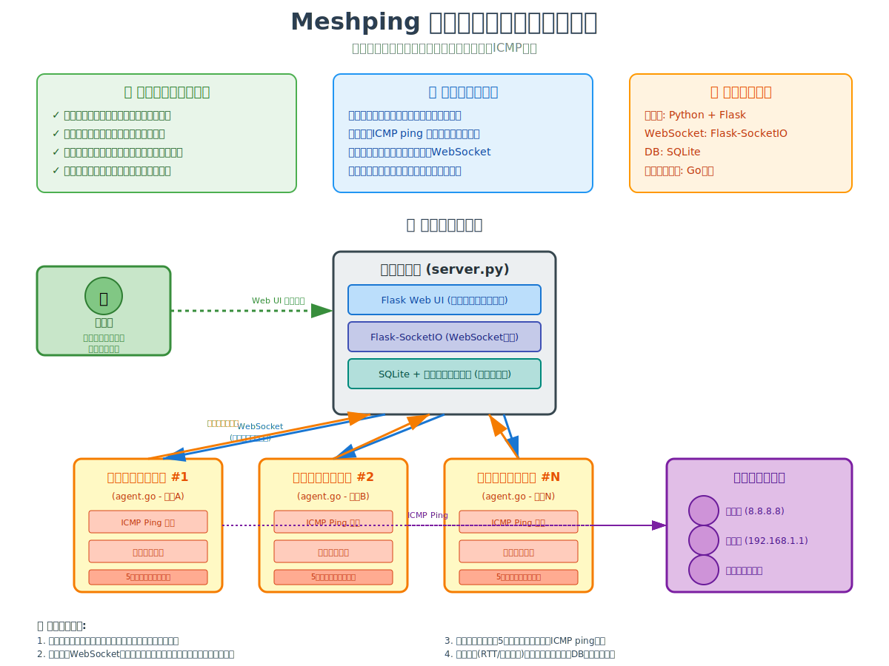

# Meshping

Meshpingは、管理サーバと監視エージェントによるネットワーク監視システムです。  
本プロジェクトは、Flask/Flask-SocketIO、SQLiteを用いた管理サーバと、Go言語による監視エージェントで構成されます。

## システム概要図

システム全体の構成と動作の流れは以下の図をご覧ください：



## 構成

- **管理サーバ (server.py)**
  - FlaskアプリケーションによるWeb UIおよびREST API（管理者向けダッシュボード、監視対象更新APIなど）
  - Flask-SocketIOを利用したWebSocket通信によるエージェントとのやり取り
  - SQLiteを用いたエージェント情報・監視データの保存
  - 管理者はエージェント承認、監視対象リストの更新などを実施

- **監視エージェント (agent.go)**
  - Go言語によるICMP監視（golang.org/x/net/icmp・ipv4の利用）
  - 起動時に管理サーバへハンドシェイクおよびエージェント情報送信、本登録時に監視対象リスト取得
  - 管理サーバからプッシュされる監視対象リスト更新により対象の更新を実施
  - 5秒毎に非同期的に各監視対象へICMPエコーリクエストを実施し、結果をサーバへ送信

## 必要な環境

### 管理サーバ
- Python 3.x
- パッケージ:
  - Flask
  - Flask-SocketIO
  - Flask-SQLAlchemy
  - eventlet または gevent (SocketIOバックエンドに利用)
- SQLite（初期実装）

### 監視エージェント
- Go 1.x
- パッケージ:
  - github.com/gorilla/websocket
  - golang.org/x/net/icmp
  - golang.org/x/net/ipv4
- ICMPパケット送信には管理者権限またはRawソケットの利用権限が必要

## インストール

### 管理サーバ
1. 仮想環境の構築（任意）
   ```bash
   python3 -m venv venv
   source venv/bin/activate
   ```
2. 必要なパッケージのインストール
   ```bash
   pip install flask flask-socketio flask-sqlalchemy eventlet
   ```

### 監視エージェント
1. Go環境をセットアップ
2. 必要なパッケージのインストール（module管理の場合は`go.mod`を利用）
   ```bash
   go get github.com/gorilla/websocket
   go get golang.org/x/net/icmp
   go get golang.org/x/net/ipv4
   ```

## 実行方法

### 管理サーバ
1. データベースが未作成の場合、自動的に作成されます。
2. サーバを起動：
   ```bash
   python server.py
   ```
3. 管理ダッシュボードはブラウザで `http://localhost:5000/admin` からアクセス可能です。

### 監視エージェント
1. エージェントのコードをビルドして実行：
   ```bash
   go build -o agent agent.go
   sudo ./agent
   ```
   ※ ICMP送信には管理者権限が必要の場合があります。

## プロジェクト概要

- **監視対象リストの管理**
  - 管理サーバは全エージェントに対して監視対象リストをプッシュ配信します。  
  - エージェントは本登録時に受信した対象リスト及びその後の更新に基づき、ICMP監視を行います。

- **データの送受信**
  - エージェントは5秒毎に各監視対象へICMPエコーリクエストを非同期に送信し、結果をまとめて管理サーバに報告します。
  - 管理サーバは受信した監視データをSQLiteへ保存すると共に、直近1時間分をメモリ上にキャッシュします。

- **管理機能**
  - エージェントの承認、拒否、再認証状態の管理
  - 監視対象リストの一元更新と、更新情報の全エージェントへのプッシュ配信

## 管理画面での監視対象リストの管理

管理ダッシュボードから監視対象のIPアドレスを編集、追加、削除できます。  
- ブラウザで [http://localhost:5000/admin/targets](http://localhost:5000/admin/targets) にアクセスしてください。  
- 入力欄にカンマ区切りでIPアドレスを入力し、送信すると変更内容が全エージェントへリアルタイムにプッシュされます。

## TLS 設定 (自己署名証明書の生成と配置手順)

Meshping は TLS 経由で WebSocket (WSS) および HTTPS 通信を行います。  
自己署名証明書を利用する場合、以下の手順で証明書と秘密鍵を生成し、プロジェクトディレクトリに配置してください。

### 証明書と秘密鍵の生成方法
1. ターミナルを開き、プロジェクトディレクトリ（例: /workspaces/meshping）に移動します。

2. 以下のコマンドを実行して、自己署名証明書と秘密鍵を生成します:
    
    ```bash
    openssl req -x509 -newkey rsa:2048 -nodes -keyout key.pem -out cert.pem -days 365 \
      -subj "/C=JP/ST=Tokyo/L=Tokyo/O=Meshping/OU=IT/CN=localhost"
    ```

   - `cert.pem` と `key.pem` がプロジェクトのルートに生成されます。

### サーバの起動時の TLS 設定
- [server.py](http://_vscodecontentref_/0) の [if __name__ == '__main__':](http://_vscodecontentref_/1) 部分で、次のように証明書と秘密鍵を読み込む設定になっています。

    ```python
    if __name__ == '__main__':
        if not os.path.exists('meshping.db'):
            db.create_all()
        # SSL 証明書と秘密鍵のパスを設定（上記で生成した cert.pem と key.pem を利用）
        ssl_context = ('/workspaces/meshping/cert.pem', '/workspaces/meshping/key.pem')
        socketio.run(app, host='0.0.0.0', port=5000, ssl_context=ssl_context)
    ```

以上で、自己署名証明書を用いた TLS 設定が完了し、HTTPS および WSS での通信が可能になります。

## 注意事項
- 本実装は基本的なプロトタイプです。運用環境に合わせたセキュリティ対策やエラーハンドリング、スケーラビリティの検討が必要です。  
- ICMPの生パケット送信には適切な権限が必要ですので、実行環境の設定にご注意ください。

## ライセンス

本プロジェクトのライセンスに関する情報を記載してください。（例：MIT License）